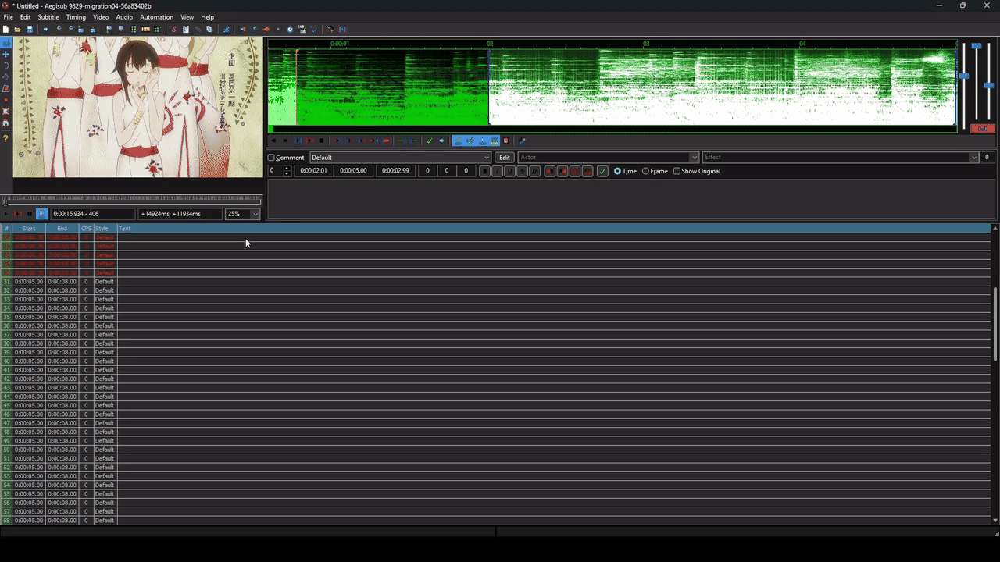
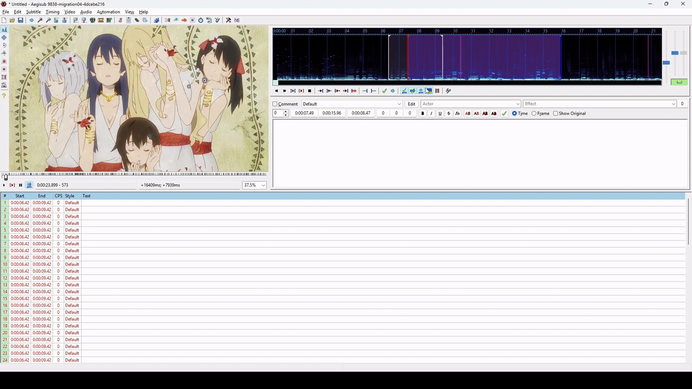

# Aegisub

This fork has some changes to the rendering pipeline.  
These changes are only relevant for Windows Builds, I don't think other platforms are affected.  
Changes and Summary were written by Claude: [Summary](https://github.com/SaltySP/Aegisub/blob/migration04/basegrid-timing-commit-throttle-summary.md)  
In short: With auto-commit enabled fast mouse movement would lag the entire UI.  
Now it only lags everything else. Perfect for timing.  

  
Before:  
  
After:  
  
